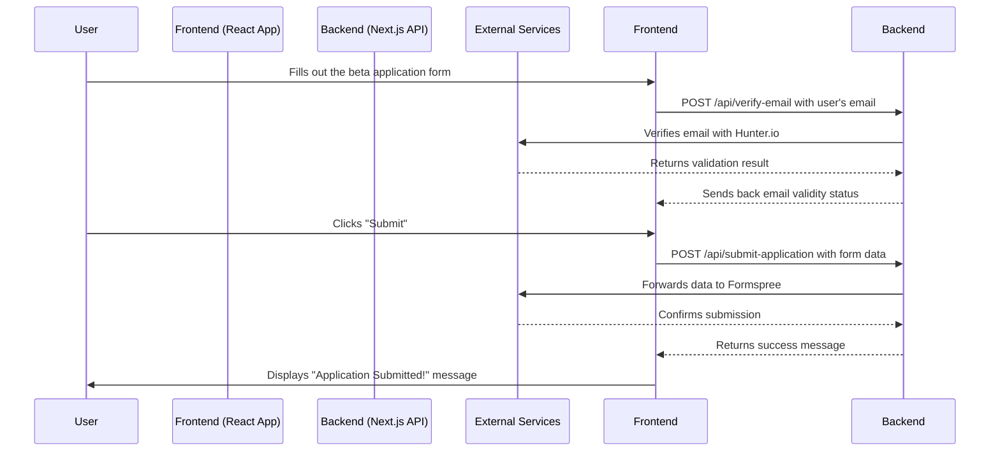

<p align="left">
   <h1> <span style="font-size: 2em; font-weight: bold;">Jeo Skill Academy - Landing Page & API</span> </h1>
</p> 


Welcome to the official repository for the Jeo Skill Academy landing page. This project is a modern, full-stack Single Page Application (SPA) designed to serve as the public-facing entry point for our learning platform. It is built with a React + Vite frontend and a Next.js backend for API services.

---

## 🚀 Project Overview

This repository contains the complete codebase for the Jeo Skill Academy landing page. Its primary purpose is to provide a fast, engaging, and informative experience for prospective students, showcasing our courses, mission, and unique features.

> **Important:** This repository **only** contains the SPA landing page and its associated backend services. The Actual Comnplete Learning Management System (LMS) is a separate application.

### Core Goals
- **Inform & Engage:** Present key information about E-Verse Academy in a clear and compelling way.
- **Capture Leads:** Collect applications from interested students through a secure and user-friendly form.
- **High Performance:** Deliver a fast, responsive, and mobile-first user experience.

---

## 🛠️ Technology Stack

The project is built with a modern, decoupled architecture, leveraging the following technologies:

### Frontend (React + Vite)
| Category          | Technology / Library                                       | Purpose                                           |
| ----------------- | ---------------------------------------------------------- | ------------------------------------------------- |
| **Core**          | `React`, `Vite`, `TypeScript`                              | Building a fast, modern, and type-safe UI.        |
| **Routing**       | `React Router`                                             | Client-side navigation and page routing.          |
| **Styling**       | `Tailwind CSS`, `Framer Motion`                            | Utility-first styling and fluid animations.       |
| **UI Components** | `Radix UI`, `Lucide React`                                 | Accessible, unstyled primitives and icon sets.    |
| **Forms**         | `React Hook Form`                                          | Performant and flexible form management.          |
| **Analytics**     | `@vercel/analytics`                                        | Tracking user engagement and site performance.    |

### Backend (Next.js API)
| Category               | Technology / Service                                       | Purpose                                           |
| ---------------------- | ---------------------------------------------------------- | ------------------------------------------------- |
| **Framework**          | `Next.js (API Routes)`                                     | Creating serverless functions for backend logic.  |
| **Email Services**     | `SendGrid`                                                 | (Future Use) Sending transactional emails.        |
| **Email Verification** | `Hunter.io`                                                | Real-time email validation to reduce invalid sign-ups. |
| **Security**           | `Google reCAPTCHA`                                         | Protecting forms from spam and automated abuse.   |

---

## 📁 Project Structure

The repository is organized into two main directories: `frontend` and `backend`.

```
root/
├── frontend/
│   ├── public/           # Static assets (images, favicon)
│   ├── src/
│   │   ├── assets/       # Logos, SVGs, etc.
│   │   ├── components/   # UI, layout, shared, and section components
│   │   ├── data/         # Static data
│   │   ├── lib/          # Utility functions
│   │   ├── pages/        # Page components
│   │   ├── routes/       # Route definitions
│   │   ├── services/     # API and service logic
│   │   ├── App.jsx       # Main app entry
│   │   ├── main.jsx      # React DOM entry
│   │   ├── index.css, App.css
│   ├── package.json, vite.config.js, tsconfig.json, README.md
├── backend/
│   ├── pages/
│   │   ├── api/          # Serverless API endpoints
│   │   │   ├── submit-application.ts
│   │   │   ├── verify-email.ts
│   │   │   └── verify-recaptcha.ts
│   ├── lib/              # Shared backend types and utilities
│   └── package.json
└── Readme.md
```

---
## 🌍 Main Features

- **Responsive Design:** Works on all devices.
- **Modern UI:** Clean, accessible, animated.
- **Dynamic Routing:** All main pages (About, Contact, Privacy, Terms, 404).
- **Reusable Components:** Consistent UI.
- **SEO Ready:** Meta tags, accessibility.
- **404 Handling:** Custom Not Found page.
- **API Endpoints:** For form submission, email verification, and (soon) reCAPTCHA verification.

---

## 🧑‍💻 Getting Started

Follow these instructions to set up and run the project locally.

### Prerequisites
- Node.js (v18 or higher)
- npm (or yarn/pnpm)

### 1. Clone the Repository
```sh
git clone https://github.com/your-username/everse-academy.git
cd everse-academy
```

### 2. Set Up Environment Variables

You will need to create `.env` files for both the `frontend` and `backend` directories.

**Backend (`backend/.env`):**
```env
# Your secret key from Google reCAPTCHA admin panel
RECAPTCHA_SECRET_KEY=your_recaptcha_secret_key

# Your API key from Hunter.io
HUNTER_API_KEY=your_hunter_api_key

# The URL of your frontend application for CORS
FRONTEND_URL=http://localhost:5173

# Your form endpoint from Formspree
NEXT_PUBLIC_FORMSPREE_URL=https://formspree.io/f/your_form_id
```

**Frontend (`frontend/.env`):**
```env
# The public site key from Google reCAPTCHA admin panel
VITE_RECAPTCHA_SITE_KEY=your_recaptcha_site_key

# The URL of your backend API
VITE_API_BASE_URL=http://localhost:3000/api
```

### 3. Install Dependencies and Run

**Run the Frontend:**
```sh
cd frontend
npm install
npm run dev
# Your frontend will be available at http://localhost:5173
```

**Run the Backend:**
```sh
# In a new terminal window
cd backend
npm install
npm run dev
# Your backend API will be available at http://localhost:3000
```

---

## 🔄 Frontend and Backend Interaction

The frontend application communicates with the backend API to handle tasks that require server-side logic or secure key management.

Here is the typical flow for the recaptcha-sequence :


Here is the typical flow for the beta application submission:



### Security Measures
- **reCAPTCHA:** The entire site is protected by Google reCAPTCHA v3. Before the main application loads, a token is verified via the `/api/verify-recaptcha` endpoint to ensure the user is human.
- **CORS:** The backend API is configured with strict Cross-Origin Resource Sharing (CORS) policies, only allowing requests from the specified `FRONTEND_URL`.
- **Secret Management:** All API keys and sensitive credentials are stored securely in environment variables on the backend and are never exposed to the client.

---

## 📄 API Endpoints

All endpoints are located in the `backend/pages/api/` directory.

| Method | Endpoint                  | Description                                                              |
| :----- | :------------------------ | :----------------------------------------------------------------------- |
| `POST` | `/submit-application`     | Submits the beta application form data to Formspree.                     |
| `POST` | `/verify-email`           | Validates a user's email address using the Hunter.io API.                |
| `POST` | `/verify-recaptcha`       | Verifies a Google reCAPTCHA token to prevent bot access.                 |

---

## 🤝 Contributing

We welcome contributions! Please follow these steps:

1.  Fork the repository.
2.  Create a new feature branch (`git checkout -b feature/your-amazing-feature`).
3.  Commit your changes (`git commit -m 'Add some amazing feature'`).
4.  Push to the branch (`git push origin feature/your-amazing-feature`).
5.  Open a Pull Request.

---

## 📬 Contact

- **Email:** m.davenoa@gmail.com
- **Phone:** +254 729 239 023
- **Location:** Nairobi, Kenya

---

## 📝 License

This project is licensed under the MIT License. See the [LICENSE](LICENSE) file for details.

---

> _Empowering Africa’s next generation of digital innovators through world-class, accessible online education._
