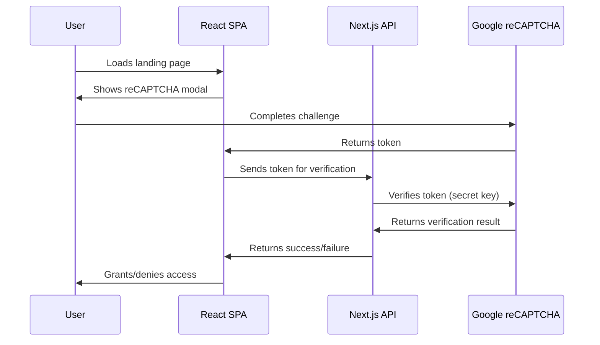
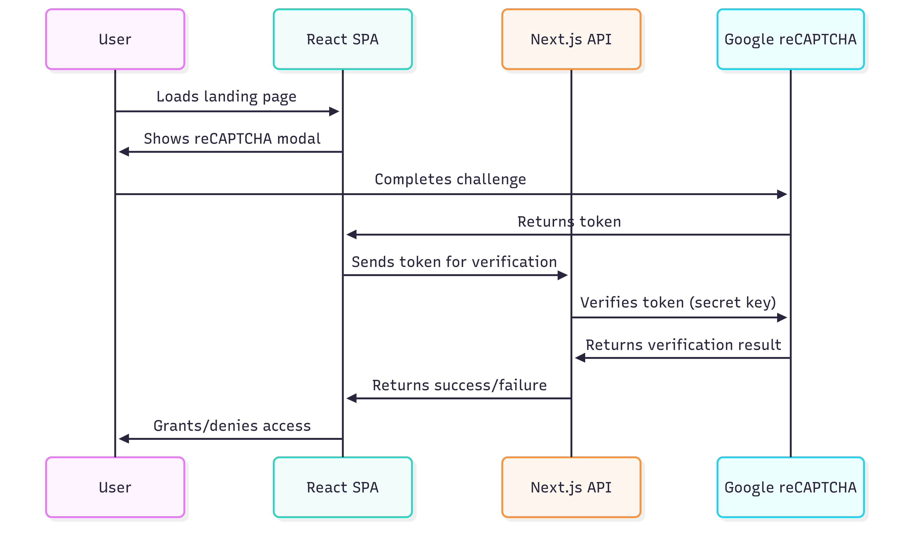

# JEO Skill Academy Kenya LMS – Fullstack Documentation

Jeo Skill Academy Kenya is a modern Learning Management System (LMS) designed to empower learners across Africa with accessible, high-quality online education. This project is a fullstack SPA application with a React + Vite frontend and a Next.js backend.

---

## �� Project Overview

This repository contains the code for the JeoSkill company landing page, built as a Single Page Application (SPA) using React and Vite. The landing page provides information about JeoSkill, its mission, and offerings.

> **Important:** The "JEO ACADEMY" button in the navigation redirects users to the JeoSkill Learning Management System (LMS), which is a separate application maintained in a different repository. This repository does **not** include the LMS codebase—only the landing page and its related features.

- **Purpose:** Deliver a robust, scalable, and user-friendly landing page for JeoSkill, serving as the public entry point for learners, educators, and organizations.
- **Features:**  
  - Project-based courses  
  - Mobile-first and offline-ready  
  - Community and mentorship  
  - Secure authentication and user management

  - **Features to Add:**  
    - Gamified progress tracking  
    - AI-powered learning suggestions 
---

## 🛠️ Tech Stack

### Frontend
- **Framework:** React (with Vite)
- **Routing:** React Router
- **Styling:** Tailwind CSS, custom CSS, framer-motion
- **UI Components:** Custom, inspired by shadcn/ui, Radix UI
- **Icons:** Lucide React
- **State Management:** React hooks, context
- **Utilities:** class-variance-authority, cn utility
- **Testing:** (Add your testing framework here if used)
- **Linting:** ESLint
- **Type Checking:** TypeScript support

### Backend
- **Framework:** Next.js (API routes)
- **Email:** SendGrid (for transactional emails)
- **Email Verification:** Hunter.io API
- **Security:** CORS, environment variable management
- **Type Checking:** TypeScript

---

## 📁 Project Structure

```
root/
├── frontend/
│   ├── public/           # Static assets
│   ├── src/
│   │   ├── assets/       # Logos, SVGs, etc.
│   │   ├── components/   # UI, layout, shared, and section components
│   │   ├── data/         # Static data
│   │   ├── lib/          # Utility functions
│   │   ├── pages/        # Page components
│   │   ├── routes/       # Route definitions
│   │   ├── services/     # API and service logic
│   │   ├── App.jsx       # Main app entry
│   │   ├── main.jsx      # React DOM entry
│   │   ├── index.css, App.css
│   ├── package.json, vite.config.js, tsconfig.json, README.md
├── backend/
│   ├── pages/
│   │   ├── api/
│   │   │   ├── submit-application.ts   # Form submission endpoint
│   │   │   ├── verify-email.ts         # Email verification endpoint
│   ├── lib/            # Shared backend logic (types, utils)
│   ├── package.json, next.config.js, tsconfig.json
```

---

## 🧑‍💻 Getting Started

### Prerequisites

- Node.js (v18+ recommended)
- npm or yarn

### Installation

#### Frontend
```sh
cd frontend
npm install
npm run dev
# Visit http://localhost:5173
```

#### Backend
```sh
cd backend
npm install
npm run dev
# Visit http://localhost:3000 (API endpoints)
```

---

## 🌍 Main Features

- **Responsive Design:** Works on all devices.
- **Modern UI:** Clean, accessible, animated.
- **Dynamic Routing:** All main pages (About, Contact, Privacy, Terms, 404).
- **Reusable Components:** Consistent UI.
- **SEO Ready:** Meta tags, accessibility.
- **404 Handling:** Custom Not Found page.
- **API Endpoints:** For form submission, email verification, and (soon) reCAPTCHA verification.

---

## 🔒 Security Features

### 1. reCAPTCHA Integration (Planned)

**Purpose:**  
Protect the LMS landing page and forms from bots and abuse by requiring users to complete a reCAPTCHA challenge.

**How it works:**
- On page load or sensitive actions, a reCAPTCHA widget/modal is shown.
- User completes the challenge, receiving a token.
- The token is sent to the backend for verification.
- Backend validates the token with Google’s reCAPTCHA API.
- Only verified users can proceed.

**Implementation Plan:**
- Use [react-google-recaptcha](https://www.npmjs.com/package/react-google-recaptcha) for the frontend.
- Add a modal or overlay on the landing page for verification.
- Create a backend API endpoint (`/api/verify-recaptcha`) to validate tokens.
- Store secret keys securely in environment variables.

**Example Flow:**


**Example Diagram:**
> _Sequence flow of the Google reCAPTCHA ._



### 2. CORS and API Security

- All backend endpoints set strict CORS headers, only allowing requests from the configured frontend URL.
- Only POST requests are allowed for sensitive endpoints.
- Environment variables are used for all secrets (API keys, etc.).

### 3. Email Verification

- Uses Hunter.io API to verify email addresses on registration or contact forms.
- Prevents disposable, gibberish, or invalid emails from being used.

---

## 📄 Main Pages & API Endpoints

### Frontend Pages

- `/` — Home (Hero, Beta, Why Us, Courses, FAQs)
- `/AboutUs` — About E-verse Academy Kenya
- `/ContactUs` — Contact form and info
- `/PrivacyPolicy` — Privacy policy
- `/TermsOfService` — Terms of service
- `/CookiesPolicy` — Cookies policy
- `*` — 404 Not Found

### Backend API Endpoints

- `POST /api/submit-application` — Handles form submissions.
- `POST /api/verify-email` — Verifies email addresses using Hunter.io.
- `POST /api/verify-recaptcha` — (Planned) Verifies reCAPTCHA tokens.

---

## 🤝 Contributing

1. Fork the repo
2. Create your feature branch (`git checkout -b feature/your-feature`)
3. Commit your changes (`git commit -am 'Add new feature'`)
4. Push to the branch (`git push origin feature/your-feature`)
5. Open a Pull Request

---

## 📬 Contact

- **Email:** m.davenoa@gmail.com
- **Phone:** +254 729 239 023
- **Location:** Nairobi, Kenya

---

## 📝 License

This project is licensed under the MIT License.

---


---

> _Empowering Africa’s next generation of digital innovators through world-class, accessible online education._


